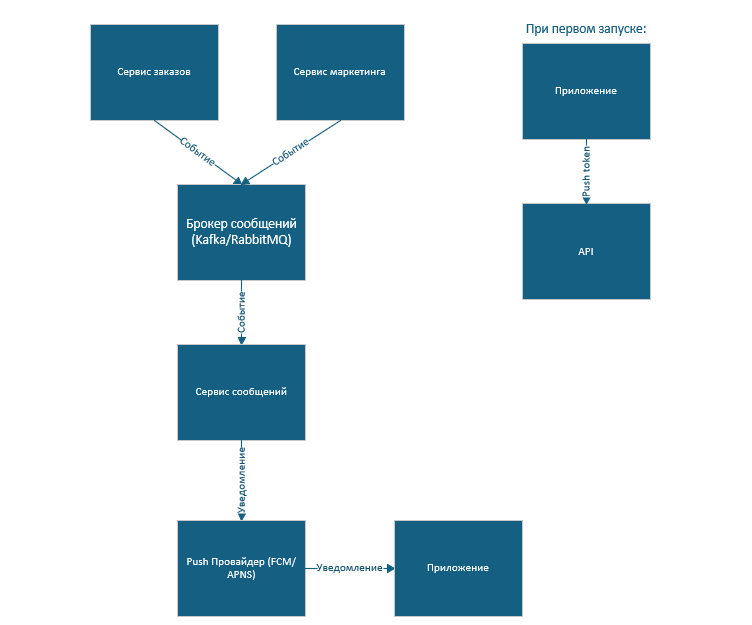

# Задание 1
### 1. Противоречия: 
1. п.7 и п.13 
  В первом говорится, что цены фиксированные, второе - противоречит ему
2. п.5
  Бессмысленный, т.к. в п.3 уже указано, что товары могут отличаться
3. п.9 и п.2 
   Противоречие в способе удаления товара
4. п.1, п.3 и п.4
   Максимум может быть 20 товаров, но если пользователь добавит максимальное количество товаров (5) в максимальном количестве единиц (10), то суммарно выйдет 50 товаров. ТЗ не объясняет какой из лимитов выполняется приоритетнее
5. п.1, п2 и п.9
   Исходя из п.1 и п.2 - минимальное количества товара в корзине = 1, однако п.9 говорит об обратном
6. п.6
   Не указано явно про какой лимит именно говорится: про общий лимит в 20 единиц или про лимит на один товар в 10 единиц
7. п.11
   Что считать утром, а что вечером? Указано размыто
8. п.10
   Неясно, обязательна реклама или нет, также не указан формат рекламы
9. п.8
   Не учитываются другие обязательные элементы корзины (например, кнопку удаления)
10. Отсутствует 12 пункт

### 2. Предложенное ТЗ:
1. Количество одного товара в корзине должно находиться в диапазоне от 1 до 10 единиц.
2. Максимум может быть 5 различных товаров в корзине.
3. Максимальное количество единиц товаров в корзине = 20.
4. Для удаления товара используется отдельная кнопка.
5. При нарушении любого лимита, система показывает сообщение: "Превышен лимит {тип_лимита}".
6. Если цена на товар изменилась в каталоге, система должна автоматически обновить ее в корзине у всех пользователей.
7. В корзине должна быть реклама других продуктов в виде карусели баннеров.
8. Реклама в корзине отображается по будням: утром с 8:00 до 12:00, вечером с 18:00 До 00:00.
9. На странице корзины должен отображаться список с полным набор данных по каждому продукту:
   - название;
   - цена за единицу;
   - текущее количество и возможность его изменения;
   - общая стоимость позиции;
   - кнопка удаления товара.  
Также должен отображаться рекламный блок (если активен)

### 3. Уточняющие вопросы:
1. Какой именно формат рекламы должен быть?
2. Является ли реклама обязательной или опциональна?
3. Что считать утром, а что вечером?
4. Реклама персональная или общая?
5. Какой лимит в приоритете: 5 разных видов товаров или 20 единиц всего?
6. Можно ли вводить количество вручную или только с помощью +/- ?
7. Цена должна быть фиксированной при добавлении товара в корзину или изменяться динамически при изменении в самом каталоге?
8. Должна ли присутствовать общая сумма корзины?

# Задание 2
### 1. Запрос к API:
GET api/stores/
### 2. Пример ответа API:
```json
{
    stores: [
        {
            "id": 1,
            "name": "METRO",
            "logo_url": "some_url.com/logo.png",
            "external_resource": "some_url2.com",
            "estimated_delivery_time": "Сегодня 21:00 - 23:00",
            "type": "scheduled"
        },
        {
            "id": 2,
            "name": "АШАН",
            "logo_url": "some_url3.com/logo.png",
            "external_resource": "some_url2.com",
            "estimated_delivery_time": "Сегодня 18:00 - 20:00",
            "type": "scheduled"
        }
        ...
    ]
}
```
# Задание 3

